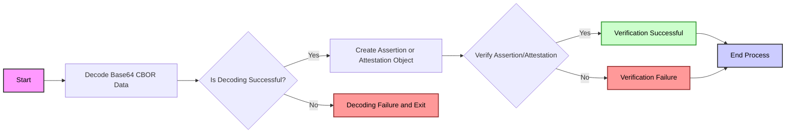

# appattest-rs
A Rust crate for validating Apple App Attestations and Assertions, ensuring the integrity and authenticity of apps running on iOS devices.

## Overview
`appattest-rs` offers a Rust-based solution for integrating Apple's App Attestation mechanism into your server-side applications. This allows you to verify that the app communicating with your server is genuine and has not been modified. This crate is particularly useful for enhancing the security of your iOS applications by utilizing Apple's [DeviceCheck](https://developer.apple.com/documentation/devicecheck) capabilities.



## Features
- **Validation of App Attestations**: Ensure that the attestation received from an iOS device is valid and conforms to Apple's guidelines.
- **Assertion Verification**: Verify assertions made by iOS applications to confirm their authenticity.

## Usage

### Verifying an Attestation
```rust
use appattest_rs::attestation::Attestation;

fn main() {
   let app_id = "<APPLE_TEAM_ID>.<APPLE_APP_ID>"; // replace this with yours. E.g 9000738U8.auth.iphone.com
    let key_id = "ZSSh9dOqo0iEvnNOtTGIHaue8n4RN/Dd8FiYFphsKTI=";
    let challenge = "5b3b2303-e650-4a56-a9ec-33e3e2a90d14";
    let base64_cbor_data = "o2NmbXRv...";

    let attestation_result = Attestation::from_base64(base64_cbor_data);
    match attestation_result {
        Ok(attestation) => {
            match attestation.verify(challenge, app_id, key_id) {
                Ok(_) => println!("Verification successful!"),
                Err(e) => println!("Verification failed: {:?}", e),
            }
        },
        Err(e) => println!("Failed to decode and create attestation: {:?}", e),
    }
}
```

### Verifying an Assertion
```rust
use appattest_rs::assertion::Assertion;
use base64::{engine::general_purpose, Engine};

fn main() {
    let client_data_json = r#"{"challenge": "5b3b2303-e650-4a56-a9ec-33e3e2a90d14"}"#.as_bytes().to_vec();
    let app_id = "<APPLE_TEAM_ID>.<APPLE_APP_ID>"; // replace this with yours. E.g 9000738U8.auth.iphone.com
    let public_key_base64 = "BLROJkpk8NoHVHAnkLOKWUrc4MhyMkATpDyDwjEk82o+uf+KCQiDoHZdlcJ1ff5HPgK7Jd/pTA3cyKOq5MYM6Gs=";
    let public_key_byte = general_purpose::STANDARD.decode(public_key_base64).expect("unable to decode public key");
    let previous_counter = 0;
    let stored_challenge = "5b3b2303-e650-4a56-a9ec-33e3e2a90d14";
    let base64_cbor_data = "omlzaWdu....";

    let assertion_result = Assertion::from_base64(base64_cbor_data);
    match assertion_result {
        Ok(assertion) => {
            match assertion.verify(client_data_json, app_id, public_key_byte, previous_counter, stored_challenge) {
                Ok(_) => println!("Verification successful!"),
                Err(e) => println!("Verification failed: {:?}", e),
            }
        },
        Err(e) => println!("Failed to decode and create assertion: {:?}", e),
    }
}
```


## References
For more detailed documentation, visit the following resources:
- [Apple Developer: Validating apps that connect to your server](https://developer.apple.com/documentation/devicecheck/validating-apps-that-connect-to-your-server)
- [WWDC 2021 - Session 10244](https://developer.apple.com/videos/play/wwdc2021/10244/)